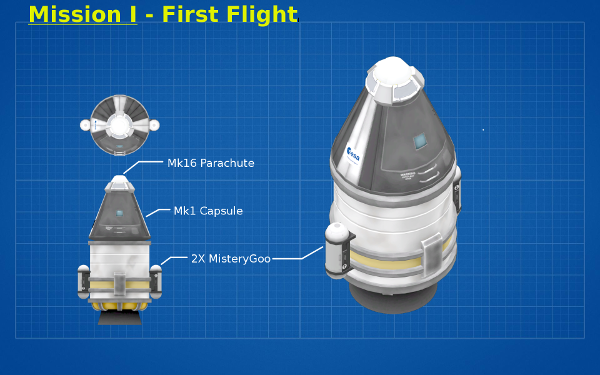

# Mission I

## Goal

Start a first rocket and get our first science

## Details

This is the first Mission! We accepted the first contract and we will launch our first rockets.

It is also important to get the science at each flight to reduce the costs.

The mission is quite simple:
- get some science from the launch pad
- Start and go straight
- On the apoapsis make science again
- Deploy the parachute at 3000m or when the velocity is just bellow the safety velocity to deploy it.

The python code can be found here:
MissionI.py[MissionI.py](./MissionI.py)
